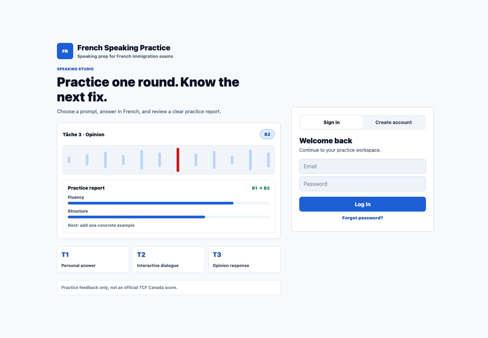
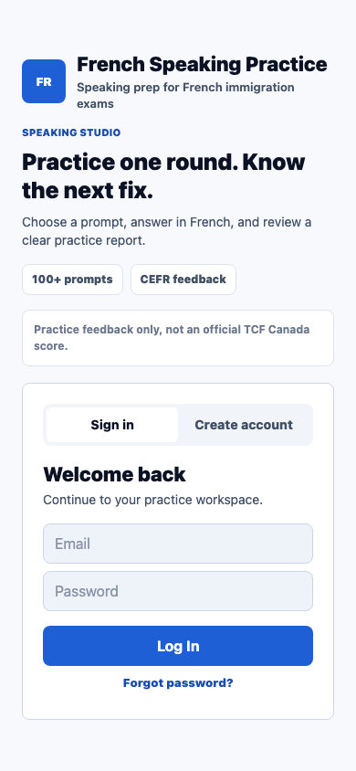

# TCF Canada

**An AI speaking coach for French immigration exam preparation.**

TCF Canada helps learners build a repeatable speaking practice routine with AI-generated guidance: choose a target level, answer realistic French prompts, receive structured speaking feedback, and review progress over time.

[Launch Web App](https://tcf-canada-gamma.vercel.app)

## Overview

Preparing for a French speaking exam is difficult without frequent practice and clear feedback. TCF Canada uses AI to make that loop simple: practice, understand what needs improvement, and return to targeted speaking work.

The product is built for independent learners who want a focused AI practice tool instead of a generic language app.

## Who It Is For

- Learners preparing for French-speaking immigration exams.
- Candidates who need structured speaking practice across everyday topics.
- Users who want feedback tied to levels such as A1, A2, B1, and B2.
- Self-study learners who need a lightweight way to review progress and saved practice items.

## AI Product Experience

### AI Speaking Feedback

TCF Canada turns each practice attempt into actionable feedback. Instead of only giving a score, the product highlights where an answer can become clearer, more fluent, and better organized.

### Level-Aware Guidance

Users can choose a target level such as A1, A2, B1, or B2. The AI feedback experience is designed around helping learners understand the gap between their current answer and their target level.

### Personalized Practice Loop

The product helps learners repeat the most important loop in speaking preparation: answer a prompt, receive guidance, save useful practice items, and return to targeted review.

### Speaking Practice

Users practice with exam-style French speaking prompts and can build familiarity with common oral-response patterns.

### Structured Improvement Notes

Feedback is organized around clarity, fluency, structure, and next-step improvement. The product is designed to help users understand what to improve, not only whether an answer was good or bad.

### Saved Practice List

Users can save useful prompts and revisit them later, turning weak areas into a focused review list.

### Progress Review

Practice history and review flows help users see how their speaking work changes over time.

### Web And Mobile Access

The product is available on the web, with mobile testing underway for Android and iOS release readiness.

## Product Status

| Area | Status |
| --- | --- |
| AI speaking practice | Active |
| Web app | Live |
| Android device testing | Active |
| iOS release preparation | In progress |
| Store readiness | In progress |
| Paid launch preparation | In progress |

## Product Principles

- Make AI feedback practical, specific, and easy to act on.
- Keep the practice loop fast and focused.
- Make speaking improvement understandable for non-technical learners.
- Prioritize speaking improvement over decorative complexity.
- Support exam preparation without pretending to replace official exam guidance.

## Privacy & Safety

TCF Canada is designed with privacy and exam-prep safety in mind:

- Practice feedback is presented as learning guidance, not an official exam score.
- Account controls include data export and account deletion readiness.
- The product avoids publishing private user information in public materials.
- Public showcases do not expose source code, credentials, model prompts, internal operations, or release artifacts.
- Monitoring is used to improve reliability while keeping private operational details out of public documentation.

## Built By

TCF Canada is an independent product built by **Zoe**.

## Public Showcase Note

This repository is a product showcase. Source code, private operational details, credentials, internal documentation, and release artifacts are intentionally not published here.
