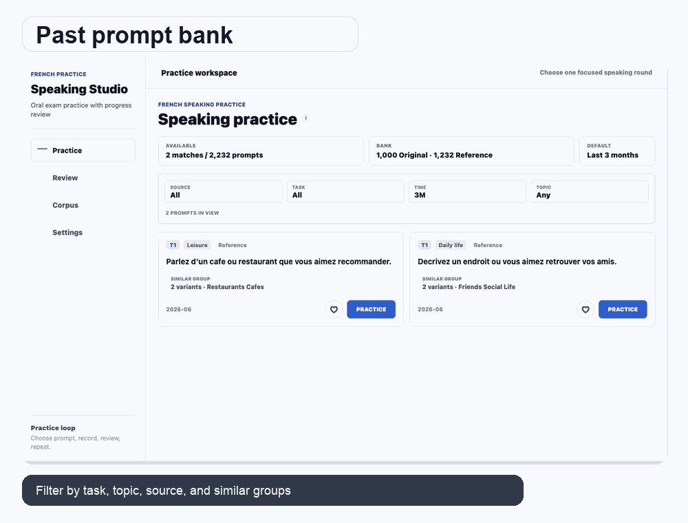

# SpeakCanada AI

**Independent AI speaking practice for TCF Canada preparation.**

SpeakCanada AI helps independent learners preparing for TCF Canada practice French speaking with a fast improvement loop: choose a target level, answer realistic speaking questions, receive AI-guided feedback, and return to focused review.

[Launch Web App](https://tcf-canada-gamma.vercel.app)

[View Public Landing Page](https://zoetw88.github.io/tcf-canada-showcase/)

<em>AI-guided practice flow: question selection, speaking answer, level-aware feedback, and feedback review.</em>

## Product Snapshot

| Area | Detail |
| --- | --- |
| Product type | AI speaking coach |
| Audience | Learners preparing for TCF Canada speaking practice |
| Core workflow | Prompt bank, answer-based AI follow-up, final script/report, saved examples, related prompt recommendation |
| Level targets | A1, A2, B1, B2 |
| Live product | Web available now |
| Mobile readiness | Android device testing active, iOS preparation in progress |
| Showcase languages | English, Traditional Chinese, Simplified Chinese, French, Hindi, Arabic, Filipino/Tagalog, Urdu |

## Why This Exists

Speaking preparation is difficult to do alone. Learners can read vocabulary lists or complete grammar drills, but after answering a speaking question they often still ask the same question: what should I improve next?

SpeakCanada AI is built around that moment. It turns each speaking attempt into a clear review cycle so learners can practice more often, understand their weak points, and return to the questions that matter.

## AI Product Experience

### AI Speaking Feedback And Follow-Up

Each answer becomes an interaction. T1 and T3 can continue with answer-based follow-up questions, T2 is a same-page examiner dialogue, and the final report shows the full script after the practice sequence.

### Level-Aware Guidance

Learners choose a target level such as A1, A2, B1, or B2. The feedback experience then helps them understand the gap between the answer they gave and the level they are working toward.

### Focused Review Loop

Users can save useful examples, return to previous questions, and repeat targeted speaking rounds. Saved examples help recommend related prompts, so one useful story can become several focused practice sessions.

### Simple Daily Workflow

The product is designed for frequent use: pick a speaking question, answer, review feedback, save what matters, and continue.

## User Journey

| Step | User Experience | Product Value |
| --- | --- | --- |
| 1 | Choose interface language and target level | Reduces setup friction |
| 2 | Select a speaking question | Keeps practice concrete |
| 3 | Answer in French | Builds speaking habit |
| 4 | Review AI-guided feedback | Makes improvement visible |
| 5 | Save useful practice items | Supports targeted review |

## Product Preview

  

## Privacy & Safety

SpeakCanada AI is designed with privacy, safety, and exam-prep clarity in mind:

- AI feedback is learning guidance, not an official score or guarantee.
- Public showcase materials do not include private user data.
- Source code, credentials, internal prompts, operational details, and release artifacts are intentionally not published.
- Account controls are designed with export and deletion readiness in mind.
- Monitoring is used for reliability while keeping private operational details out of the public showcase.
- The product is clearly positioned as an independent study tool.

## Commercial Readiness

| Area | Status |
| --- | --- |
| AI speaking practice | Active |
| Web product | Live |
| Android device testing | Active |
| iOS release preparation | In progress |
| Store readiness | In progress |
| Paid launch preparation | In progress |

## Product Principles

- Make AI feedback specific, understandable, and useful.
- Keep the practice loop fast enough for daily repetition.
- Design for learners who study independently.
- Prioritize speaking improvement over visual noise.
- Be clear that AI practice feedback is not an official exam result.
- Keep public materials polished without exposing private implementation details.

## Built By

SpeakCanada AI is an independent product built by **Zoe**.

This public repository is a product showcase. It demonstrates the product, positioning, visual experience, and launch readiness without publishing the private application source code.

## Independence Notice

SpeakCanada AI is an independent study product and is not affiliated with, endorsed by, or operated by France Education International, any official exam provider, or any government agency. TCF Canada is referenced only to describe the exam preparation context.
